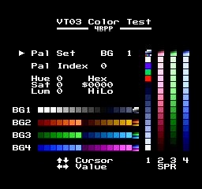
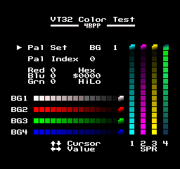
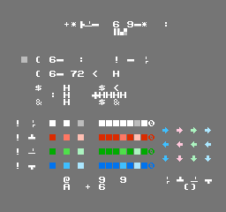

VT03 and VT32 Color Tests
=========================
Written by freem
- initial release: 2021/05/27 (May 27, 2021)
- VT32 support added on 2025/11/03 (November 3, 2025)

Introduction
------------
The VT03 and VT32 Color Tests are small utility ROMs allowing you to preview
palette colors using the "new color mode" found on VT03 and VT32-based machines.

VT03's "new color mode" has somewhat unintuitive color values, so this tool
is a helpful way to figure out what values to use.

VT32, on the other hand, uses a straightforward RGB444 color format.

More information can be found on the NESdev Wiki's ["VT03+ Enhanced Palette" page](http://wiki.nesdev.com/w/index.php/VT03%2B_Enhanced_Palette).

Requirements
------------
- VT03 Color Test: VT03-supporting emulator (NintendulatorNRS, EmuVT, MAME) or hardware (untested, as I don't own any VT03 devices)
- VT32 Color Test: NintendulatorNRS or hardware  (untested, as I don't own any VT32 devices)

Files
-----
Aside from this text file, there are four ROM files included in this package:
- `colortest-vt03_emuvt.bin`
- `colortest-vt03_onebus.nes`
- `colortest-vt03_waixing.nes`
- `colortest-vt32_onebus.nes`

The difference(s) are explained in the "Technical Details" section.

The source code builds with asm6f, but should also work with regular asm6.

Some screenshots are also included, mainly for documentation's sake.

Interface
---------
  

Background palettes are found near the bottom middle of the screen, while the
Sprite palettes are on the right. Each palette preview includes solid color
swatches, as well as a single 4bpp tile showing all 16 colors of the palette
set.

The value labeled "Hex" is the two bytes required to define the color.
"Lo" is written to `$3F00-$3F7F`, "Hi" is written to `$3F80-$3FFF`.

There are five items that can be modified, two of which are shared between
VT03 and VT32 modes:

- "**Pal Set**" refers to the active set of palettes being edited.
  Values range from BG (Background) 1 to BG 4, followed by SPR (Sprites) 1 to SPR 4.
- "**Pal Index**" refers to the specific color within the selected palette set.
  Values range from `0-F` (0-15).

The VT03 Color Test-specific controls:
- "**Hue**" modifies the Hue of the current color.
- "**Sat**" modifies the Saturation of the current color.
- "**Lum**" modifies the Luminance of the current color.

The values for Hue, Sat, and Lum range from `0-F` (0-15).

The VT32 Color Test-specific controls:
- "**Red**" modifies the Red value of the current color.
- "**Blu**" modifies the Blue value of the current color.
- "**Grn**" modifies the Green value of the current color.

The values for Red, Blu, and Grn range from `0-F` (0-15).

Usage
-----
Use the D-Pad to move the cursor (Up/Down) and change values (Left/Right).
If you need to reset, press Select+Start.

Technical Details
-----------------
This program was developed using emulators as the testing platform.
It may or may not work on real hardware. I don't have any to test with.

As for the four ROM files...

"`colortest-vt03_waixing.nes`" was the first version developed.
It abuses a "feature" of NES 2.0 Mapper 256. If you look closely, you'll
notice that the "_waixing" ROM has CHR-ROM defined. In reality, OneBus
cartridges have no CHR-ROM, as everything is mapped into a shared address
space.

The [NESdev Wiki's Mapper 256 page](http://wiki.nesdev.com/w/index.php/NES_2.0_Mapper_256) has this to say:
> "ROM images converted from Waixing's WXN format will have both PRG and
> CHR ROM, yet use the VTxx-native bankswitch registers and/or register
> address mangling. These images cannot be run unchanged on physical hardware,
> and were intended to be run by Waixing's proprietary VTxx emulator found
> on several 32-bit plug-and-play consoles. For simplicity, mapper 256 is
> also used for such ROM images"...

This solution, while great for quick tests, doesn't really work well
on EmuVT, or even real hardware.



Indeed, running "`colortest-vt03_waixing.nes`" on EmuVT will produce incorrect
behavior, shown above.

To solve this problem, one must produce a ROM image that matches what the VT03
expects in terms of CHR and PRG-ROM locations.

From the VT03 datasheet:
>"In one bus mode, the program initial address A24-A0 is `007FFFC`, and the video
> initial address is `0000XXX`."

This means the smallest possible OneBus ROM is 512 kilobytes.

By arranging the CHR-ROM to appear at the beginning of the file, and adding
enough padding between the CHR data and the PRG banks, the ROM file can work
properly on EmuVT.

**`colortest-vt03_onebus.nes`** is a NES 2.0 Mapper 256 image that is meant for
use with NintendulatorNRS.

**`colortest-vt03_emuvt.bin`** is the above file without an iNES header.
It can be run in NintendulatorNRS, EmuVT, and MAME.

Running the bin file in MAME requires loading it as an existing ROM. I have been using
"`vtsndtest`" as a surrogate. Make the "`vtsndtest`" directory if it doesn't already exist
in your MAME ROMs folder, then copy the .bin file there and rename it to `rom.bin`.

**`colortest-vt32_onebus.nes`** is the VT32 Color Test, a NES 2.0 Mapper 256
image that is meant for use with NintendulatorNRS.

--------------------------------------------------
Though it's not immediately obvious, the demo uses 4bpp tiles.
(They are found at the right edge of the background palette preview,
and at the top of the sprite palette preview.)

Each 4bpp graphics page is twice the size of its 2bpp counterpart.
Keep this in mind if you're going to do tests with the Waixing emu hack.

Graphics for this tool were created using [YY-CHR](https://w.atwiki.jp/yychr/)'s "4BPP 8X8" mode.

For more technical information on the graphics formats supported
by the VTxx hardware series, check [the NESdev Wiki "VT02+ CHR Pattern Data Layout" page](http://wiki.nesdev.com/w/index.php/VT02%2B_CHR_Pattern_Data_Layout).

--------------------------------------------------
And now, the real important information: How to set up the palette for 4BPP mode.

Low Byte
--------

Address | `$x0-$x3` | `$x4-$x7` | `$x8-$xB` | `$xC-$xF`
--------|-----------|-----------|-----------|----------
`$3F0x` |  BG1 0-3   |  BG2 0-3   |  BG3 0-3   |  BG4 0-3   |
`$3F1x` | SPR1 0-3   | SPR2 0-3   | SPR3 0-3   | SPR4 0-3   |
`$3F2x` |  BG1 4-7   |  BG2 4-7   |  BG3 4-7   |  BG4 4-7   |
`$3F3x` | SPR1 4-7   | SPR2 4-7   | SPR3 4-7   | SPR4 4-7   |
`$3F4x` |  BG1 8-11  |  BG2 8-11  |  BG3 8-11  |  BG4 8-11  |
`$3F5x` | SPR1 8-11  | SPR2 8-11  | SPR3 8-11  | SPR4 8-11  |
`$3F6x` |  BG1 12-15 |  BG2 12-15 |  BG3 12-15 |  BG4 12-15 |
`$3F7x` | SPR1 12-15 | SPR2 12-15 | SPR3 12-15 | SPR4 12-15 |

High Byte
---------

Address | `$x0-$x3` | `$x4-$x7` | `$x8-$xB` | `$xC-$xF`
--------|-----------|-----------|-----------|----------
`$3F8x` |  BG1 0-3   |  BG2 0-3   |  BG3 0-3   |  BG4 0-3   |
`$3F9x` | SPR1 0-3   | SPR2 0-3   | SPR3 0-3   | SPR4 0-3   |
`$3FAx` |  BG1 4-7   |  BG2 4-7   |  BG3 4-7   |  BG4 4-7   |
`$3FBx` | SPR1 4-7   | SPR2 4-7   | SPR3 4-7   | SPR4 4-7   |
`$3FCx` |  BG1 8-11  |  BG2 8-11  |  BG3 8-11  |  BG4 8-11  |
`$3FDx` | SPR1 8-11  | SPR2 8-11  | SPR3 8-11  | SPR4 8-11  |
`$3FEx` |  BG1 12-15 |  BG2 12-15 |  BG3 12-15 |  BG4 12-15 |
`$3FFx` | SPR1 12-15 | SPR2 12-15 | SPR3 12-15 | SPR4 12-15 |

In old color mode, you just write the regular NES color values to the Low Byte section (`$3F00-$3F7F`).

### VT03 new color mode low byte
```
76543210
xx|||__|
  ||  |
  ||  +-- Hue
  ++----- Luminance (lower 2 bits)
```

### VT03 new color mode high byte
```
76543210
xx|__|||
    | ||
    | ++-- Luminance (upper 2 bits)
    +----- Saturation
```

### VT32 new color mode low byte
```
76543210
xx|||__|
  ||  |
  ||  +-- Red
  ++----- Green (lower 2 bits)
```

### VT32 new color mode high byte
```
76543210
xx|__|||
    | ||
    | ++-- Green (upper 2 bits)
    +----- Blue
```
